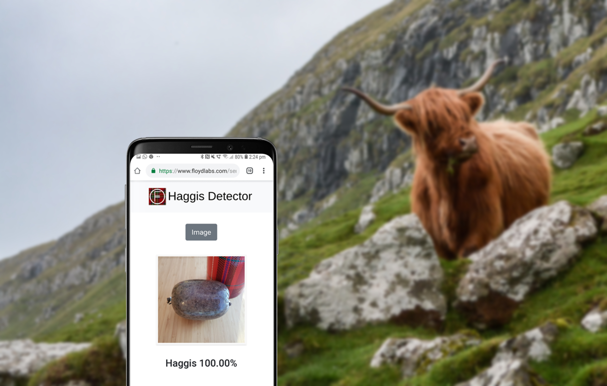

# FloydHub Haggis Detector

Every year on the 25th of January, people around the world gather together to celebrate the life and poetry of Scotland’s national poet, Robert Burns. A typical Burns Night consists of friends and family, poetry readings, tartan clothing, and a lot of whisky. But the highlight of any reputable Burns Night is the address to the haggis, where that most reviled of Scottish foods is brought into the dining room on a gleaming silver platter and sacrificed in the name of Robert Burns.

Accompanied by a proud bagpiper, the haggis receives a rousing toast (usually from a rather drunk uncle) before succumbing to its fate of feeding ten to twenty hungry Scots. There’s pomp, there’s circumstance, and it’s all a bit ridiculous — but I guarantee you will have a great time at a Burns Night!

Those of you who weren’t born and raised in Scotland probably have a question at this point. 

> What the heck is a haggis? 

This is a simple question with no simple answer. Haggis is different things to different people, but hopefully by the end of this article you will at least be able to recognize one.

To make your quest to find a haggis a little easier, I will take you through how you can build, train, and deploy a haggis detection app on FloydHub. We’ll train a state-of-the-art deep learning image recognition system to detect a haggis using Keras and TensorFlow and deploy it to a simple Flask web app.

You can find the FloydHub blogpost associated with this project here: LINK

You can also click the 'Run on FloydHub' button to launch a FloydHub Workspace with the data and this GitHub repo attached:

 

Happy haggis hunting!

